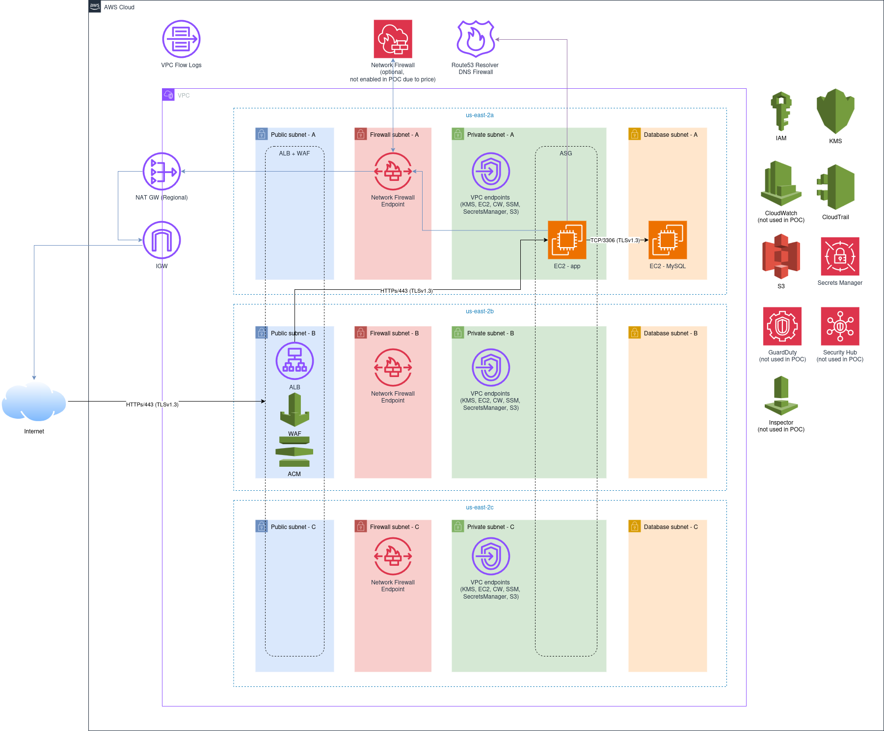

# POC — PCI DSS on AWS

## Overview



---

## Endpoints

| Path             | URL                                           |
|------------------|-----------------------------------------------|
| App              | <https://pci-dss-dev.pomeshk.in>              |
| ALB health check | <https://pci-dss-dev.pomeshk.in/alb-check>    |

---

## Pre-requirements

| Requirement            | Details                                                                                                                                                                                                       |
|------------------------|---------------------------------------------------------------------------------------------------------------------------------------------------------------------------------------------------------------|
| HTTP support           | Application uses HTTP and can leverage ALB.                                                                                                                                                                   |
| Git-based execution    | `terragrunt` runs from a git repo — [`get_repo_root()`](https://terragrunt.gruntwork.io/docs/reference/built-in-functions/#get_repo_root) will fail otherwise.                                                |
| Route 53 NS delegation | After `basement` is applied, a Route 53 public zone is created. **Before** applying subsequent layers, create NS records in the parent zone pointing to the newly created zone. |

---

## Terragrunt Structure

- The `env` folder contains the IaC structure: `<ENV>/<AWS_REGION>/<INFRA_LAYER/STACK>`.
- The `modules` folder contains Terraform code structured as modules for each `<INFRA_LAYER>`. Module names match their corresponding layer names.

---

## Terragrunt Hierarchy

1. `basement` — CloudTrail, IAM roles, KMS keys, public Route 53 zone, S3 buckets
2. `network` — VPC components, ACLs and security groups, ALB, ACM, private Route 53 zone
3. `compute` — EC2 with MySQL, ASG with app

---

## How to Run

```bash
# Ensure AWS profile is set up
cd terragrunt
tg hcl fmt && tf fmt -recursive
cd env/dev
tg run --all init --backend-bootstrap  # Run once to create the S3 bucket for Terraform state
tg run --all apply
```

---

## PCI DSS Requirements (POC Scope)

- 🔒 **No unencrypted traffic** — even inside the VPC (ALB → EC2-app and EC2-app → MySQL use TLS v1.3)
- 🚦 **Least-privilege** — traffic is allowed by the principle of least privilege
- 💾 **Encryption at rest** — S3, EBS, logs, and all other data stores are encrypted
- 🛡️ **WAF** attached to ALB *(skipped)*
- 🔥 **AWS Network Firewall** enabled *(skipped — cost)*
- 🔍 **Route 53 Resolver Firewall** *(skipped)*
- 📋 **Logging** enabled for all operations

---

## Allowlisted Domains

- `example.com.`
- `secureweb.com.`
- `*.${AWS_REGION}.amazonaws.com.` (for VPC endpoints)

---

## Documentation

- [AWS Network Firewall — Central Inspection VPC](https://catalog.workshops.aws/networkfirewall/en-US/setup/centralmodel/inspectionvpc)
- [Secure VPC DNS Resolution with Route 53 Resolver DNS Firewall](https://aws.amazon.com/blogs/networking-and-content-delivery/secure-your-amazon-vpc-dns-resolution-with-amazon-route-53-resolver-dns-firewall/)
- [Stateful Rule Groups — Domain Names](https://docs.aws.amazon.com/network-firewall/latest/developerguide/stateful-rule-groups-domain-names.html)

---

## TODO

- [ ] Fix ALB logging (S3 bucket policy / ACL)
